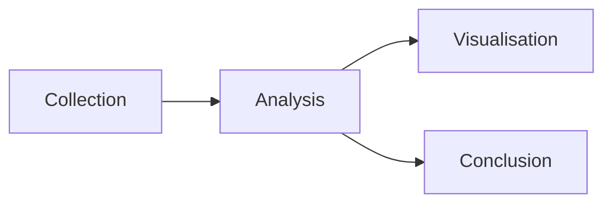
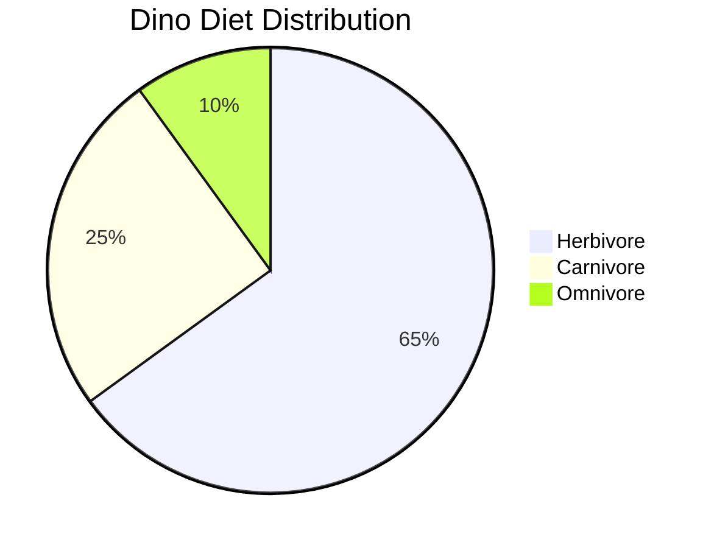

# DinoDiet

**Principal Investigator:** Dr. Geller[^1]

## Project Description

This project[^1] aims to analyse the dietary habits of dinosaurs during 
the late Cretaceous period. We will be focusing on the differences
between herbivorous and carnivorous dinosaurs.

!!! note
    The project will include data collection, analysis, and visualisation of the findings.

## Sections

- [Data Collection](#data-collection)
- [Data Analysis](#data-analysis)
- [Data Visualisation](#data-visualisation)
- [Conclusion](#conclusion)

A simple plan for progressing through the technical stages of the project
is shown below:



### Data Collection

We will be gathering data from various sources, including fossil records,
scientific literature, and online databases. We've listed some key sources
below, check them out!

1. [Paleobiology Database](https://paleobiodb.org)
2. [The Fossil Forum](https://www.thefossilforum.com/)
3. [Research articles from the Journal of Vertebrate Paleontology](https://www.tandfonline.com/toc/ujvp20/current)

### Data Analysis

!!! tip inline end
    R is our primary tool for statistical analysis.

The data will be analysed using statistical methods to identify patterns
and trends in the dietary habits of dinosaurs. We will be comparing the
diets of herbivorous and carnivorous dinosaurs to understand their food
preferences and ecological roles.

We will be using programming for our data analysis. Here is a sample of
how we will load the data in different languages.


=== "R"
    ```r title="analysis.R" linenums="1"
    library(tidyverse) # Load the necessary libs
    
    dino_data <- read_csv("dino_data.csv") # Read the data
    ```

=== "Python"
    ```python title="analysis.py" linenums="1"
    import pandas as pd  # Load the necessary libs
    
    dino_data = pd.read_csv("dino_data.csv")  # Read the data
    ```

### Data Visualisation

We will create graphs and charts to visualise the findings from our analysis.
This will help us better understand the relationships between different dinosaur
species and their diets. For instance, we will include visualisations such as pie
charts for proportions of herbivorous and carnivorous dinosaurs, and bar graphs
for the comparison of average body sizes.

!!! warning
    Dinosaur images may be frightening.

An example of a dinosaur image we will use for reference in our
visualisations can be found below:

<figure markdown>
{ width="600" }
<figcaption>Example dinosaur reference image</figcaption>
</figure>

### Conclusion

The goal of this project is to gain a deeper understanding of the dietary habits
of dinosaurs during the late Cretaceous period. The findings from this research
could provide insights into the evolution and ecology of these fascinating creatures
and potentially reveal new information about their extinction event.

??? info "Further Info"
    For more information about dinosaurs and their diet, visit the American Museum of
    Natural History's website at https://www.amnh.org/

## Contributor Reference

### Hunger Factor :material-chart-line-variant:

The Hunger Factor (HF) is an important metric in our work. We calculate it
with the following equation:

HF = √(Food Eaten²)

### DinoSoft Bugs :material-bug:

When calculating large HF scores for dinosaurs, the DinoSoft software may crash.
Please reboot your machine with ++ctrl+alt+delete++.

[Read the DinoSoft Docs!](DinoSoft){ .md-button .md-button--primary }

### Dino Diets :fontawesome-solid-dragon:

For reference, here is a summary of the diets and primary food sources
of some well-known dinosaur species:

| Dinosaur Species | Diet      | Primary Food Sources |
|:----------------|:----------|:--------------------|
| Triceratops      | Herbivore | Ferns, cycads, and horsetails |
| Tyrannosaurus    | Carnivore | Triceratops, Edmontosaurus |
| Stegosaurus      | Herbivore | Ferns, mosses, and cycads |
| Velociraptor     | Carnivore | Small herbivorous dinosaurs |
| Brachiosaurus    | Herbivore | High tree foliage, such as conifers |
| Spinosaurus      | Carnivore | Fish, small to medium-sized dinosaurs |
| Oviraptor        | Omnivore  | Eggs, plants, small animals |

More widely, we estimate the following distribution of dinosaur diets:



## Roadmap

To track the progress of the project, we will be using this roadmap:

- [ ] Data Collection
    - [x] Collect data from fossil records
    - [ ] Collect data from scientific literature
    - [x] Collect data from online databases
- [ ] Data Analysis
    - [ ] Clean and preprocess the data
    - [ ] Perform statistical analysis
    - [ ] Identify patterns and trends
- [ ] Data Visualisation
    - [ ] Create graphs and charts
    - [ ] Integrate visualisations in the report
- [ ] Conclusion
    - [ ] Summarise findings
    - [ ] Discuss implications for dinosaur evolution and ecology
    - [ ] Suggest future research directions

[^1]: This is a fictional research project undertaken by a fictional principal investigator. For educational purposes only.